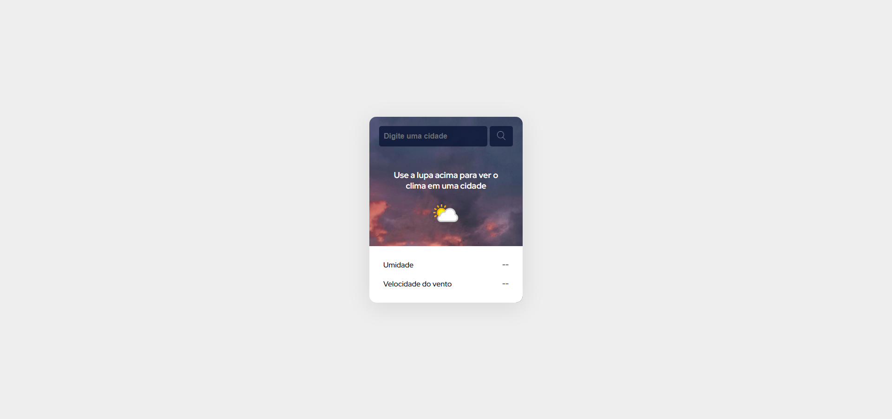

# Previsão do Tempo

- site que mostra dados sobre o clima de uma cidade.
- resolve problemas de desinformação sobre o clima e a prevenir imprevistos.

## Demonstração


* [ver site do projeto](https://gkptan.github.io/app-weather-forecast/)

## Estrutura do projeto

```
app-weather-forecast/
├── index.html
└── src/
    ├── css/
    │   ├── reset.css
    │   └── style.css
    ├── imagens/
    │   ├── background.png
    │   └── lupa.png
    └── js/
        └── index.js
```

## Tecnologias utilizadas

- HTML
- CSS
- JavaScript
- Consumo da Api do site weather.

## Funcionalidades

- Ao digitar o nome da cidade e clicar/apertar na lupa, vai aparecer: nome da cidade, temperatura atual, clima atual (sol, chuva ou nublado), umidade em %, e velocidade do vento em km/h.

## Aprendizados

- Consumo de api: montar URL com chave e parâmetros e consumir a `WeatherAPI` usando fetch (checando resposta.status e fazendo resposta.json()).
- Async/await e tratamento de erros: uso de `async/await` e `try/catch` para lidar com falhas de rede e erros de API.
- Manipulação do DOM: selecionar elementos com `querySelector` e `getElementById`, atualizar `textContent` e `setAttribute` para ícones.
- leitura de `input.value` e validação simples.
- Formatação e exibição de dados: extrair `temp_c`, `condition`, `humidity`, `wind_kph` e formatar strings para a UI.
- UX básico: placeholders, mensagens de erro visíveis, e ícones para melhorar a experiência.

## API

O projeto consome a WeatherAPI (https://www.weatherapi.com/) para obter dados de clima em tempo real. Não há API própria, as chamadas são feitas diretamente do front-end em `index.js`.

### EndPoint usado

- GET https://api.weatherapi.com/v1/current.json

### Exemplo de Requisição

- GET https://api.weatherapi.com/v1/current.json?key=YOUR_KEY&q=Lisbon&aqi=no&lang=pt

### Parâmetros principais

- `key`: chave da API (obrigatória).
- `q`: cidade (ex: São Paulo, Gramado etc...)
- `aqi`: Qualidade do ar ("no" significa desativada).
- `lang`: idioma da resposta (usamos "pt").

### Campos utilizados na resposta

- `current.temp_c`: temperatura em °C.
- `current.condition.text`: descrição do clima (sol, chuva, nublado).
- `current.condition.icon`: URL do ícone correspondente.
- `current.humidity`: umidade em %
- `current.wind_kph`: velocidade do vento em km/h.

## Problemas e Bugs

- Se tiver encontrado algum bug ou problema, sinta-se à vontade para abrir uma issue com os detalhes ou corrigir o problema.